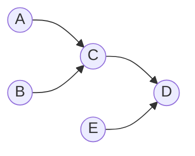

# LIQUIDO

## A Whitepaper on Secure, Anonymous and Liquid Voting

**Version 0.5 — 2026**

---

## About this document

This is not a user guide. It is an argument.

LIQUIDO is a family of electronic voting products. There is another user guide that explains *how* to use them. This whitepaper explains *why* they are built the way they are.

## Organization of this document

**[Part I](#part-i--foundations-of-democratic-voting): Voting theory**: What every democratic voting system must guarantee. Direct and representative democracy and how Liquid Democracy adresses their structural problems. This first part makes no claims about any particular technical system and can be read on its own.

**[Part II](#part-ii--preferential-voting): Preferential Voting**: Voters sort proposals into their preferred order. Focusing on Marquis de Condorcet’s 1785 foundational framework and Nicolaus Tideman’s Ranked Pairs algorithm as robust methods for collective decision-making.

**[Part III](#part-iii--the-limits-of-this-approach): Limits of this approach**: Individual verifiability vs receipt-freeness, anonymity vs pseudonomity, Arrow’s imposibility theorem and Gibbard–Satterthwaite (1973/1975)

**[Part IV](#part-iv--cryptographic-building-blocks): Cryptographic Building Blocks**: Hash functions and Keyed hashing (HMAC)

**[Part V](#part-v--liquido): LIQUIDO**: implemented as a progressive web application (PWA) with a Java Quarkus backend and a GraphQL API. Its design decisions are grounded in the theoretical framework established above. [Part III](#part-iii--the-limits-of-this-approach), however, establishes fundamental limits that no voting system can overcome. This raises the question of how LIQUIDO can nevertheless provide useful and progressively stronger guarantees within those limits. It does so through **three tiers**, ordered by increasing levels of both security and ambition:

1. **Polly** - simple, secure and anomymous vote among friends. No passwords, just a biometric passkey.
2. **LIQUIDO Team Polls** - secure, anonymous and fair voting within a team that has to decide something together.
3. **Liquid Democracy with proxies** — the full blown model with a liquid tree of delegations

Each tier is presented with an honest statement of what it guarantees, against whom, and what it does not guarantee. A voting system whose limitations are undocumented is not a secure voting system; it is an unaudited one.

**[Part VI](#part-vi--positioning-and-roadmap): Positioning and Roadmap**: What LIQUIDO is and is not for today, who can learn what about whom, and what remains to be built.

**Changelog** with a record of what changed in each version, and why,  [at the end of this document.](#changelog) 

---

# Part I — Foundations of Democratic Voting

[Social choice theory](https://en.wikipedia.org/wiki/Social_choice_theory) studies the behavior of different mathematical procedures ([social welfare functions](https://en.wikipedia.org/wiki/Social_welfare_function)) used to combine individual preferences into a coherent whole. Real-world examples of social choice rules include [constitutions](https://en.wikipedia.org/wiki/Constitution) and [parliamentary procedures](https://en.wikipedia.org/wiki/Parliamentary_procedure) for voting on laws, as well as [electoral systems](https://en.wikipedia.org/wiki/Electoral_system); as such, the field is occasionally called **voting theory**

## 1. What any democratic voting system must guarantee

Any democratic vote, paper or electronic, must be **free**, **equal** and **secret**. In a governmental election these are not design preferences but constitutional requirements. For example German Basic Law, Article 38(1), names five: *allgemeiner, unmittelbarer, freier, gleicher und geheimer Wahl* — universal, direct, free, equal and secret suffrage — and most democratic constitutions state an equivalent. The first two govern who may vote and through what electoral system; the remaining three govern the ballot itself, and are this document's subject:

- **Free** — the voter chooses how to vote, without coercion.
- **Equal** — every vote counts the same. No ballot outweighs another.
- **Secret** — the voter is not required to reveal their choice. They *may* say how they voted, but nobody can compel proof.

[Electronic voting research](https://de.wikipedia.org/wiki/Internetwahl) has decomposed these into a more precise vocabulary. The terms below are used consistently throughout this document.

| Property | Definition |
|---|---|
| **Eligibility** | Only entitled voters can cast a ballot, and each at most once. |
| **Ballot secrecy** | An observer cannot determine how a given voter voted. |
| **Individual verifiability** | A voter can check that *their* ballot was recorded and counted as cast. |
| **Universal verifiability** | Anyone can check that the published tally follows from the recorded ballots. |
| **Receipt-freeness** | A voter *cannot* prove to a third party how they voted, even if they want to (Benaloh & Tuinstra, 1994). |
| **Coercion-resistance** | Receipt-freeness that also survives an adversary who watches the voter, demands their credentials, or forces abstention (Juels, Catalano & Jakobsson, 2005). |
| **Scalability** | The voting system must work with thousands of voters. |
| **Software independence** | An undetected change in the software cannot cause an undetected change in the outcome (Rivest & Wack, 2006). |

## 2. History of direct and representative democracy

Democracy — from the Greek δημοκρατία, *dēmokratía*, rule by the people — names any system in which state authority ultimately rests with the population rather than with a ruler above it. That is a statement about where power comes from, not about how it is exercised. The mechanics have been the contested part for two and a half thousand years.

In its original Athenian form, citizens assembled in one place and deliberated. This scales badly. Beyond a few thousand participants it is not possible to discuss everything with everybody, and the assembly stops being a deliberative body and becomes a crowd.

Two answers to this scaling problem have dominated the last two centuries, and neither of them is the assembly. **Direct democracy** in its modern form keeps the decision with the citizens but gives up the gathering: instead of debating together, people vote separately, by ballot, on a question put to them. **Representative democracy** keeps the deliberation but hands it to a small body elected to do it full time. Both work at the scale of a nation. Both have structural weaknesses.

### 2.1  Weaknesses of Direct Democracy

Direct democracy grants maximum civic autonomy but suffers from significant structural limits:

- **Voter Fatigue and Participation Costs**: Requiring citizens to vote on every technical, legislative, and administrative detail leads to plummeting turnout, participation bias toward highly motivated special interest groups, and superficial voter engagement.
- **Information Asymmetries and Competence Constraints**: Individual voters rarely possess the time or domain expertise required to evaluate complex technical proposals (e.g., monetary policy or environmental engineering).

### 2.2 Weaknesses of Representative Democracy

Representative democracy mitigates voter fatigue by delegating decision-making to a small cadre of full-time politicians, but introduces severe structural failures:

- **The Missing Control (Fixed-Term Mandate Lock-in)**: In representative systems, a voter delegates their complete legislative agency to a candidate or political party for a fixed, long-term tenure (e.g., 4 to 5 years). During this entire legislative period, the voter exerts **zero direct institutional control** over specific policy choices. Once elected, representatives can break campaign promises, vote against their constituency’s preferences, or prioritize party discipline and lobbyist interests without risk of immediate removal or override.
- **Principal-Agent Alignment Loss**: The representative (agent) frequently acts in alignment with personal career incentives, party leadership, or campaign donors rather than the interests of the voter (principal).
- **Coarse-Grained Preference Aggregation**: Voters are forced to accept or reject bundled platforms containing hundreds of disparate policy positions, making precise preference expression impossible.


The question this whitepaper takes seriously is therefore not "direct or representative?" but: **is there a system that recovers the responsiveness of direct democracy without requiring every citizen to be an expert in everything?**

## 3. Liquid Democracy

### 3.1 Literature Overview and Historical Context

The formal exploration of flexible proxy voting traces back to the late 19th century, notably in the work of Charles Dodgson (Lewis Carroll) in 1884 on parliamentary representation, and later James Miller in 1969 on transferable proxies. In recent decades, the convergence of computational social choice, network theory, and cryptographically secure digital platforms has formalized this paradigm under the nomenclature of **Liquid Democracy**.  

In contemporary academic literature, Liquid Democracy is analyzed through binary aggregation, epistemic social choice theory, and graph-theoretic delegation dynamics. The concept was given its modern formulation by Bryan Ford in *Delegative Democracy* (2002), and developed practically by the LiquidFeedback project (Behrens, Kistner, Nitsche & Swierczek, *The Principles of LiquidFeedback*, 2014). Scholars evaluate Liquid Democracy both as an epistemic mechanism—testing whether transitive delegation yields higher probabilities of identifying a “ground truth” optimal policy under Condorcet’s Jury Theorem framework—and as a political mechanism for preference alignment and proportional stake representation.

### 3.2 “What is Liquid Democracy?”: Core Mechanics

Liquid Democracy is a dynamic proxy voting architecture in which every eligible voter possesses full voting power and can choose, on an issue-by-issue or domain-by-domain basis, between two fundamental operational modes:

- **Direct Voting**: The voter directly casts their ballot on a given proposal or issue. (as in direct democracy)
- **Delegation to a proxy**: The voter temporarily delegates their voting power to a chosen delegate, a “proxy” (as in representative democracy)

A voter who delegates does not surrender their ballot; they nominate someone to cast it on their behalf until they take it back. The proxy then votes once, and that single act counts once for the proxy and once for every voter who has delegated to them. 

Unlike formal elections in representative systems, becoming a delegate requires no costly campaign, party approval, or minimum electoral threshold. Any participant can serve as a proxy.

Formally, representative democracy is the point in the space where every voter delegates all topics to a single proxy for a fixed term, and direct democracy is the point where nobody delegates at all. Both are corners of the same space. Liquid democracy does not *replace* direct or representative democracy. It *contains* them. It is the space itself.

### 3.3 How Liquid Democracy mitigates the above challenges

Liquid Democracy bridges this dichotomy by introducing fluid, dynamic representation:

- **Mitigating Voter Fatigue**: Citizens delegate their votes on topics where they lack time or expertise, reducing cognitive overhead.
- **Eliminating the “Missing Control”**: Voters are never locked into a multi-year mandate. Because delegation can be revoked instantly or overridden on any single issue, representatives and proxies face continuous, real-time accountability.
- **Optimizing Expertise (Epistemic Efficiency)**: By enabling domain-specific transitive delegations, vote weight naturally flows toward trusted domain experts, increasing the competence of the decision-making body without stripping individual voters of their rights.

None of this obliges anyone to participate. There is no penalty for delegating, no obligation to vote, and no expectation that a citizen form an opinion on every question. The objection that people neither can nor want to decide everything themselves is therefore not an argument against liquid democracy, because liquid democracy never required it.

### 3.4 Delegation to a proxy

A delegation in Liquid Democracy has the following properties:

- **Direct Override**: Voters retains absolute sovereignty over their vote. When a voters disagrees with their delegate’s vote on a specific issue, or simply wishes to participate directly in a specific poll, then the voter can **always** cast a direct ballot. Even after the proxy has already voted for them. Then the direct ballot automatically **overrides the proxies vote** for that specific poll.
- **Granular and Domain-Specific Delegation**: Voters can assign delegates based on topic expertise (e.g., delegating environmental policy to expert $X$ and economic policy to expert $Y$).
- **Time-sensitive Delegation** Voters can decide to divest their vote only for a certain period of time or delegations need to be re-confirmed regularly.
- **Revocation**: A delegation **can be revoked at any time.** It can also be reassigned to another proxy at any time. This dynamic is the most important, newly introduced concept by Liquid Democracy. 
- **Transitive**: Delegations are transitive across a directed graph. A proxy may in turn decide to delegate his (accumulated) right to votes to another upper proxy. 
- **Acyclic**: A delegation may not close a cycle. Every chain has to end at a voter who has not delegated, because that is the only person in it who can actually cast the accumulated vote. A cycle has no such voter: its delegations point only at each other and never reach anybody who will decide, so the delegated power is simply never exercised. A voter therefore cannot delegate to somebody who already delegates, directly or transitively, to him.

Together these make a delegation provisional rather than a transfer. It is a default that holds only for as long as the voter leaves it in place, and because delegations can be granted and withdrawn continuously, the resulting graph is never at rest. Hence *liquid*.

The fact that delegations can transitivly be forwarded has some important consequences that need further inspection:

### 3.5 Proxy delegations form a liquid tree (a constantly changing directed graph)

**Example of a delegation graph**



The proxies vote is weighted by the accumulated voting power of all their transitive delegees behind them. In the above example, proxy $D$ has a accumulated a weight of 5. He votes for $A$, $B$, $C$, $E$ and for himself $D$. In the wording of represantative democracy: “A party votes with the weighted power of all the votes that they received during the last election.” But this weight does not change during a legislative term. The **new concept** that Liquid Democracy introduces is, that this power may change at any time. Voters are free to override, revoke or resassign their delegation at any time. This has an **immideate** effect on the voting power of the proxy.

That weight of 5 is what $D$ carries if he is the only one who votes. It is not fixed: should $C$ vote, or should $A$ vote for himself, the ballots they produce take precedence over $D$'s for everyone they cover. The next section sets out exactly which cast counts for whom.

### 3.6 Effective Proxy and Top Proxy

Take voter $A$ from the graph above. $A$ delegated to $C$, and $C$ in turn delegated to $D$. $D$ has not delegated to anybody, so the chain ends there. From $A$'s point of view the two proxies sit at different **distances**: $C$ is his direct proxy, one step away, and $D$ is two steps away — somebody $A$ never chose and may not know.

Any voter in that chain may cast a ballot, and each cast also creates a ballot for everyone below the person casting. So a ballot may be placed on $A$'s behalf by $C$, or by $D$, or by $A$ himself. Two positions therefore need names:

- The **top proxy** is the voter at the end of the chain, here $D$. It follows from the shape of the delegation graph and is the same in every poll.
- The **effective proxy** is whoever actually cast the ballot that ends up counting for $A$ in one particular poll. It is decided per poll, and it may be the top proxy or any proxy in between.

**The nearest cast wins.** A ballot standing for a voter is replaced only by one cast closer to him, and a ballot he cast in person is never replaced at all. Which of the proxies voted *first* does not enter into it:

| | Who casts a ballot | What now stands for $A$ | $A$'s effective proxy |
|---|---|---|---|
| $t_1$ | $D$, the top proxy | $D$'s ranking, from two steps away | $D$ |
| $t_2$ | $C$, $A$'s direct proxy | $C$'s ranking — one step away, so it replaces $D$'s | $C$ |
| $t_3$ | $A$ himself | $A$'s own ranking, and this one is final | none |

Run those casts in the other order and $A$ ends in the same place. Had $C$ voted before $D$, then $D$'s later cast would not have reached $A$ at all: it stops at $C$, who has already decided for himself, and everyone below $C$ keeps $C$'s ranking. The same is true one step further down — once $A$ has voted in person, nothing any proxy does afterwards touches his ballot.

This is why the rule is stated in terms of distance rather than as "the most recent cast wins". Under a recency rule a proxy at the top of a long chain could overwrite the judgement of the proxy a voter actually chose, merely by voting late. The design assumes instead that a voter trusts a nearer proxy more than a distant one, because the nearer one is the one he picked.

Where delegation is topic-specific ([Section 3.4](#34-delegation-to-a-proxy)), both positions are per topic: a voter has one top proxy for each topic he delegates, and one effective proxy per topic and poll. Topics are described in [Chapter 10](#10-tier-3--liquid-democracy-with-proxies).

### 3.7 Should a voter see how his proxy voted?

[Chapter 1](#1-what-any-democratic-voting-system-must-guarantee) listed eight properties a democratic voting system may be asked to provide. Two of them come into direct conflict as soon as a proxy votes for somebody else:

| Property | Definition |
|---|---|
| **Ballot secrecy** | An observer cannot determine how a given voter voted. |
| **Individual verifiability** | A voter can check that *their* ballot was recorded and counted as cast. |

When a proxy casts a ballot, a ballot is created for each delegee carrying the proxy's ranking. The two properties then pull against each other:

1. **Ballot secrecy** says a delegee should not learn how any other voter voted — his own proxy included.
2. **Individual verifiability** says a voter must be able to check the ballot that was counted for him — and that ballot carries exactly that ranking.

It is worth being exact about where this bites, because it is not the same for everybody. A voter who casts in person cannot have one without the other: checking that a ballot was recorded *as cast* means comparing it against what he submitted. A delegee is differently placed. He submitted nothing. A system could tell him only that a ballot exists for him, placed by his proxy, and withhold the ranking — and that would still verify the one act he actually performed, which was delegating. So the two can be separated for a delegee. Whether they should be is a decision, not a consequence.

The decision taken here is that they should not be. **Every voter can check his own vote, and this does not weaken when somebody else casts it.** A voter who has handed his voting power to another person has the strongest claim of anyone to see what was done with it; telling him only that *something* was done in his name verifies the bookkeeping rather than the vote. So a delegee reads his own ballot in full, and thereby learns how his effective proxy voted. (Whether he should also see *who* that proxy was is a separate question, taken up in [Section 3.9](#39-privacy-of-the-delegation-tree).)

That decision has a price, and it falls on the proxy rather than on the delegee: accepting a delegation costs a proxy the secrecy of his own ballot toward everyone below him, and nothing restores it. What can be done is to make the loss deliberate rather than accidental.

**Delegation requests.** A voter must *request* to delegate his right to vote, and the proxy must actively accept. By accepting, a proxy gains voting power and, in the same act, makes all his future votes visible to the delegating voter, to everyone delegating through that voter, and to everyone who later joins the subtree beneath him — including people he never dealt with directly. That is the trade, and it is why the acceptance has to be explicit rather than assumed.

### 3.8 Do delegations always need to be transitive?

A very similar issue as down the delegation tree from the previous chapter arisis upwards along the delegation chain. When a voter decides to delegate his vote to a proxy, he does not only trust the proxy to vote for him, but he also trusts the proxy that he might in turn delegate both their (collected) votes further upwards. Maybe to someone he doesn’t even know.

A voter may designate a delegation as **non-transitive**, thereby restricting the designated proxy from further propagating that delegation to another proxy. Consequently, a proxy may hold two distinct classes of delegated voting rights: **transitive delegations**, which may be forwarded further upstream, and **non-transitive delegations**, which may be exercised only by the proxy itself.
This distinction introduces a subtle issue in the voting protocol. An intermediate proxy may incorrectly assume that no action is required once an upstream proxy has cast a vote on its behalf. However, the intermediate proxy must still cast a vote independently in order to establish a ballot for any downstream non-transitive delegations. This remains necessary even when the intermediate proxy intends to cast the same vote as the upstream proxy.

### 3.9 Privacy of the delegation tree

Which parts of the delegation tree should be visible for whom?

| **Entity** | **Visible to whom** |
|---|---|
| Direct Proxy | Is known to the voter who delegated. He knows his direct proxy anyway |
| Top Proxy | May be shown to a voter. |
| Effective Proxy (per poll) | A voter already can see how his effective proxy voted. It would make sense to also show who voted for him. Especially if its not his direct proxy. |
| The full delegation chain of a voter | Questionable. One migth consider this a privacy issue for proxies along the chain |
| The full tree of all delegations |  Should remain private. Publishing it creates bias. And possible also supports larger proxies that they would receive even more delegations. | 

### 3.10 Criticism of Liquid Democracy

Liquid democracy has been studied for two decades and deployed in several organisations, and the objections below come from that record.

One class of objection can be set aside first. Much of the published criticism — that voting power piles up in a few hands, that people delegate everything and then stop paying attention — assumes a voter who hands over his vote and never acts again. Such a voter is worse off under any system, and under representative democracy he is worse off for a fixed term with no way back. Liquid democracy is the only one of the three arrangements in which he can take his vote back at any moment, including after his proxy has already cast it. The consequences of not voting are real, but they are consequences of not voting, not of delegation.

What follows are the objections that survive once that assumption is removed: costs a voter incurs by delegating **deliberately**, which no other system imposes.

**Delegation destroys the independence its own epistemic case requires.** [Section 3.1](#31-literature-overview-and-historical-context) invoked Condorcet's Jury Theorem, which holds only if voters judge independently of one another. Delegation attacks that premise by construction. A hundred voters behind one proxy do not contribute a hundred judgements; they contribute one judgement counted a hundred times. Kahng, Mackenzie and Procaccia (2021) show that liquid democracy can be *less* accurate at recovering a ground truth than everyone simply voting for themselves, and that no delegation rule using only local information can guarantee otherwise. The expertise routing claimed in [Section 3.3](#33-how-liquid-democracy-mitigates-the-above-challenges) is a possible outcome of the mechanism, not a property of it — and the better a proxy is at attracting delegations, the weaker the statistical argument for trusting the result becomes.

**A proxy has no ballot secrecy.** [Section 3.7](#37-should-a-voter-see-how-his-proxy-voted) showed that this cannot be avoided: a delegee who can check his own ballot thereby learns his proxy's ranking. Every other arrangement in this document can offer a secret ballot to every participant. Liquid democracy cannot offer one to anybody who accepts a delegation. A system in which taking responsibility is paid for in privacy may select for the people least troubled by being watched, which is not the same as selecting for the people best suited to decide.

**Concentration makes coercion cheap.** The previous point is about privacy; this one is about what an adversary does with it. Buying or coercing an electorate is expensive because it has to be done retail. Delegation opens a wholesale market: a proxy holding ten thousand delegations is a single point at which ten thousand votes can be bought — and, because his ballot is readable by everyone below him, a single point at which the buyer can *verify* the purchase. Kling, Kunegis, Hartmann, Strohmaier and Staab (2015) found that concentration of this order does occur in practice, in the German Pirate Party's use of LiquidFeedback. That it occurs is not by itself the objection. The objection is that when it does, the coercion-resistance discussed in [Part III](#part-iii--the-limits-of-this-approach) is defeated at a handful of nodes rather than across a population.

**Revocability is exit, not voice.** A parliamentarian sits inside institutions: a public record of how they voted, a chamber in which they must argue, an opposition, a press that reports on a known list of office holders. A proxy has none of that. Blum and Zuber (2016) argue that instant revocability, offered as the stronger form of accountability, is in fact a different and thinner one. A voter can leave his proxy, but he has no standing to make that proxy explain himself, and a delegation withdrawn in silence produces no public argument at all. Liquid democracy increases an individual's control over his own vote while removing the forum in which collective reasoning used to happen.

None of these is a demonstration that liquid democracy fails, and none of them has been answered either. They are the open questions, and the arrangement should be judged on what it does about them in practice rather than on what its definition promises. One thing it certainly does not do is escape the impossibility results of social choice theory ([Section 5.3](#53-what-no-voting-rule-can-do)): liquid democracy changes *who* casts a ballot, not *what a ballot can express*.

---

# Part II — Preferential Voting

## 4. Ranking proposals instead of choosing only one alternative

A separate question from *who* votes and *how secretly* is *what a ballot may say*.

Most [electoral systems](https://en.wikipedia.org/wiki/Electoral_system) ask for a single choice, or for approval of several options. A **ranked ballot** instead asks the voter to sort the options into their preferred order. It need not demand a complete ranking: a voter may rank only the options they have an opinion about, and leave the rest unordered.

A ranked ballot is also what makes delegation meaningful. A proxy who inherits a single cross expresses one bit on behalf of their delegees; a proxy who inherits a ranking expresses a *preference structure*, and a delegee reading it back can see not only which proposal won their vote but how the alternatives were ordered beneath it. 

The reason for ranking at all is Condorcet's. In his *Essai sur l'application de l'analyse à la probabilité des décisions rendues à la pluralité des voix* (1785), Condorcet observed that plurality voting can elect an option that a majority would have rejected in a head-to-head comparison against another candidate. A ranked ballot contains enough information to detect this: from the individual orderings one can construct the **pairwise duel matrix**, counting for each pair of proposals how many voters preferred one to the other.

If some option beats every other option in a pairwise duel, it is the **Condorcet winner**, and there is a strong argument that it should win. The complication is that pairwise majorities can create a cycle: A beats B, B beats C, and C beats A. Like in the stone-paper-scissors game. A voting rule must specify what to do then.

### 4.1  Nicolaus Tideman’s Ranked Pairs Algorithm (1987)

**Ranked Pairs** (Tideman, *Independence of clones as a criterion for voting rules*, 1987) answers it. The algorithm first calculates all pairwise comparissons in a duel matrix, then sorts all pairwise victories by strength, then locks them in one at a time from strongest to weakest, skipping any victory that would create a cycle with those already locked. The result is an acyclic ordering whose source is the winner. 

**Properties of the Ranked Pairs Algorithm**

- **Condorcet Consistency**: If a Condorcet winner, that beats every other cancidate in a pairwise comparison, exists, then it will be elected.
- **Independence of Clones**: Introducing multiple near-identical alternatives cannot artificially alter the outcome by splitting the preferences for an existing alternative.
- **Monotonicity**: Increasing a winning candidate’s position on any voter’s ballot cannot cause that candidate to lose.

### 4.2 Multiple winners

Locking in pairwise victories builds a directed graph: an edge from winner to loser for every victory that did not close a cycle. The winner of the poll is that graph's **source** — the proposal with no incoming edge. Nothing in the procedure guarantees there is only one.

A second source appears whenever two proposals are never joined by a locked-in edge, while each defeats every other proposal in the poll. The clearest case is an exact pairwise tie between the two: an even split produces no victory for either side, so there is no edge between them for the algorithm ever to consider locking in — not because the rule declines to compare them, but because the pairwise vote itself did not favour either. If both are otherwise undefeated, the graph ends up with two sources, and Ranked Pairs reports two winners.

This is a genuine tie, not a defect in the count. A Condorcet method is only obliged to report what the pairwise votes actually establish, and here they establish that two outcomes are equally supported. Resolving it further requires a rule the method itself does not supply.


### 4.3 Which Victories Count as Stronger

Ranked Pairs requires a measure of victory strength to determine which pairwise preferences take precedence when resolving a cycle. Two established measures are commonly used:

- **Winning votes:** the number of voters preferring the winner.
- **Winning margin:** the difference between votes for the winner and the loser.

With complete ballots, when every voter has to rank all candidates, both measures produce exactly the same ordering of victories. With partial ballots, when a voter may only sort some candidates into his ballit however, they may differ.
This distinction matters **only when the pairwise preferences would create a cycle**. If no cycle exists, all victories can be locked without conflict, and the choice of strength measure cannot affect the result. The two measures therefore represent alternative policies for the exceptional case in which a cycle must be resolved.

---

# Part III — The Limits of This Approach

## 5. The limits of this approach

Everything proposed so far has boundaries, and some of them are not engineering problems that a later version will fix. They are results — proved, in the mathematical sense — about what any system of this kind can and cannot deliver. A whitepaper that omitted them would be a brochure.

Two of the sections below concern the secrecy of the ballot, using the vocabulary [Chapter 1](#1-what-any-democratic-voting-system-must-guarantee) already established; the third concerns the aggregation of preferences.

### 5.1 The central tension

**Individual verifiability and receipt-freeness pull in opposite directions.**

To let a voter verify their own ballot, you must give them something that distinguishes their ballot from everyone else's — a receipt, a tracking number, a checksum. But anything that lets *the voter* identify their ballot also lets them *show* it to somebody else. The instrument of verification is the instrument of coercion.

This is not an engineering oversight that a better implementation would fix. It is structural. Systems that achieve both simultaneously — Prêt à Voter (Ryan et al.), Civitas (Clarkson, Chong & Myers, 2008) — do so with substantial cryptographic machinery: mix networks (Chaum, 1981), homomorphic tallying (Cramer, Gennaro & Schoenmakers, 1997), or fake-credential schemes in which a coerced voter hands over a credential that produces a ballot which is silently discarded.

Helios (Adida, 2008) made the opposite choice explicitly: it offers strong verifiability and openly states that it is *not* coercion-resistant, on the grounds that it targets settings — professional societies, university elections, clubs — where coercion is not the dominant threat.

**The three LIQUIDO tears anser this in different ways.**

Which way a given system should resolve this depends entirely on the setting it serves. A group deciding where to hold its offsite is not a national election: there, the ability to confirm one's own ballot is worth more than protection against a coercer who has easier avenues anyway. An election whose outcome binds a population is the opposite case — coercion and vote-buying are the dominant threats, and the electorate contains people who can be leaned on by an employer, a spouse, a party or a buyer. A system aiming at that setting must *acquire* coercion-resistance rather than trade it away, without surrendering the verifiability that makes a result trustworthy. [Section 7.4](#74-what-liquido-does-about-the-limits-of-part-i) states where LIQUIDO stands on this, and [Section 10.7](#107-what-must-be-true-first-envisioned) what the harder case would require.

### 5.2 Anonymity vs Pseudonomity

There is a distinction that marketing language tends to blur, and that this whitepaper will not.

- **Anonymity** means the link between voter and ballot does not exist and cannot be reconstructed by anyone.
- **Pseudonymity** means the link exists in a protected form, and *somebody* — typically the party holding a secret key — can reconstruct it.

The distinction matters because a system may be anonymous against one adversary and merely pseudonymous against another, and an honest claim must name the adversary it is made against. Achieving anonymity against the party that holds the keys requires either threshold cryptography with distributed key holders, or a verifiable mix network. [Section 7.4](#74-what-liquido-does-about-the-limits-of-part-i) states which of the two descriptions applies to LIQUIDO today, and against whom; [Section 11.3](#113-who-can-learn-what) sets out precisely who can learn what.

### 5.3 What no voting rule can do

The ranked ballot of [Chapter 4](#4-ranking-proposals-instead-of-choosing-only-one-alternative) is a better instrument than a single cross, but it is not an escape from social choice theory. Two results bound what any rule built on it can achieve, and they bound Ranked Pairs exactly as they bound everything else.

**Arrow’s impossibility theorem** (1951) establishes a fundamental limitation of ranked voting systems. It considers any rule that takes the individual rankings of three or more alternatives and produces a collective ranking. Arrow proved that no such rule can simultaneously satisfy the following four conditions:

1. **Unrestricted domain** — the rule must work for any combination of individual rankings. Voters may rank the options however they like, and the rule must return a result.
2. **Non-dictatorship** — no single voter's preferences decide the collective ranking regardless of what everyone else submitted.
3. **Pareto efficiency** — if every voter prefers A to B, the collective ranking must place A above B.
4. **Independence of irrelevant alternatives (IIA)** — whether the collective ranking puts A above B depends only on how voters ranked A against B, and not on where any of them placed some third option C.

Arrow proved that any rule satisfying 1, 3 and 4 must violate 2: it must be a dictatorship. Equivalently, no non-dictatorial rule satisfies Pareto and IIA together.

The first three conditions are ones no serious voting rule would give up, which is why **IIA is where every rule breaks** — and Ranked Pairs is no exception. In Ranked Pairs the violation is not subtle and not hidden: it is the cycle-breaking step of [Section 4.3](#43-which-victories-count-as-stronger). Whether a pairwise victory is skipped depends on which victories were already locked in, which is to say on how voters ranked options *other than* the two being compared. A and B can therefore change places in the final ordering because voters changed their minds about C. Plurality, Borda and instant-runoff violate IIA too, by different routes.

That is not an implementation defect any of them could repair. It is the price of insisting that the output be a consistent ranking at all — the same insistence that forces the cycle-breaking in the first place. Ranked Pairs is therefore a defensible compromise, not an optimum, and any claim that some future rule will be strictly better on every axis is a claim Arrow has already refuted.

**The Gibbard–Satterthwaite theorem** shows that every non-dictatorial ranked rule is manipulable in principle: there exist situations in which a voter benefits from misreporting their true preferences. Ranked Pairs is harder to manipulate than plurality — its independence of clones defeats the most common practical attack, flooding a poll with near-identical proposals — but it is not immune, and no rule that could replace it would be.

These are the reasons the chapter is titled as it is. Liquid democracy changes *who* casts a ballot and Ranked Pairs improves *what a ballot can say*; neither changes the fact that aggregating conflicting preferences into a single collective choice involves irreducible trade-offs. The honest position is to name the trade-offs and choose deliberately, which is what the rest of this document does.

---

# Part IV — Cryptographic Building Blocks

## 6. Cryptographic building blocks

Two primitives carry the entire security argument. Both are described here in terms a non-specialist can follow, because a voting system whose security only experts can verify has a governance problem regardless of its mathematics.

### 6.1 Hash functions

A cryptographic hash function maps an input of any size to an output of fixed size, with these properties:

- The output is fast to compute from the input.
- Given only the output, the input is **not** feasible to compute. This is the "one-way" property.
- Changing the input by a single bit changes the output completely.
- Finding two inputs with the same output is infeasible in practice.

Because the input space is unbounded and the output space is not, collisions must exist mathematically. The security claim is that *finding* one is computationally infeasible.

The choice of function is not interchangeable. **SHA3-256** (NIST FIPS 202) is preferable to the older SHA-2 family wherever a construction of the form `hash(data ‖ secret)` appears, because SHA-3's sponge construction is not vulnerable to the length-extension attack that such a construction otherwise invites. MD5 and SHA-1 are cryptographically broken and must not be used for any security purpose.

### 6.2 Keyed hashing (HMAC)

A plain hash proves nothing about *who* computed it, because anyone can compute it. A **keyed** hash mixes in a secret known only to the server, so that only the server can produce or verify the value. HMAC (Bellare, Canetti & Krawczyk, 1996) is the standard construction.

The distinction matters for a specific reason. If a voter's pseudonym were `hash(email)`, anyone with a list of candidate email addresses could compute every pseudonym and de-anonymise the entire electorate offline. Mixing in a server secret makes this impossible without that secret. The security of every anonymity claim in this document therefore reduces to: **the server secret has not leaked.**

---

# Part V — LIQUIDO

[Part I](#part-i--foundations-of-democratic-voting) to [Part IV](#part-iv--cryptographic-building-blocks) made no claims about any particular system. From here on the document does: it states the decisions LIQUIDO has taken, the reasons for each, and how it addresses the limits described above.

Chapters [7](#7-the-choices-liquido-makes) to [9](#9-tier-2--liquido-team-polls) describe systems that are running. [Chapter 10](#10-tier-3--liquid-democracy-with-proxies) describes one that is designed but not yet released; it is written in the present tense because it specifies a settled design rather than an aspiration. Where the distinction matters, a claim carries one of three markers:

| Marker | Meaning |
|---|---|
| **[Implemented]** | Running in the current release |
| **[Designed]** | Specified and settled; some or all of it not yet built |
| **[Envisioned]** | The direction of travel, with open research or engineering problems named honestly |

A reader who wants to know only what exists today should read Chapters [7](#7-the-choices-liquido-makes) to [9](#9-tier-2--liquido-team-polls), and take [Chapter 10](#10-tier-3--liquid-democracy-with-proxies) as a statement of intent.

## 7. The choices LIQUIDO makes

[Part I](#part-i--foundations-of-democratic-voting) set out what a ballot must guarantee, which of those guarantees are mutually incompatible, and what no voting rule can deliver at all. This chapter turns that background into a set of concrete decisions. Everything here applies to all three tiers; the chapters that follow show each tier applying them at a different point on the trade-off surface.

### 7.1 A ranked ballot, counted by Ranked Pairs

LIQUIDO asks the voter to **sort the proposals into their preferred order**, and permits **partial ballots**: a voter ranks only the options they have an opinion about and leaves the rest unordered. An unranked proposal is treated as ranked below every proposal that voter did rank, while the unranked remain neutral among themselves.

The count is **Ranked Pairs**, for the reasons [Chapter 4](#4-ranking-proposals-instead-of-choosing-only-one-alternative) gives — it elects the Condorcet winner whenever one exists, and its independence of clones means a faction cannot gain by entering several near-identical proposals.

The implementation of the Ranked Pairs algorithm is shared between Polly and LIQUIDO team polls. It is the one component both products have in common. 

**[Implemented]**

### 7.2 Which victories count as stronger

LIQUIDO sorts by **winning votes**. Margin is not discarded but demoted to the tie-break: at equal winning votes, the victory with **fewer votes for the loser** is locked in first, which is exactly the wider margin. Winning votes is also the more resistant of the two to strategic manipulation, being a count rather than a difference and so offering fewer moving parts a voter can shift without changing their genuine preference. The metric is applied uniformly rather than chosen per poll, so two results can be compared without first establishing which rule produced each. **[Implemented]**

As [Section 4.3](#43-which-victories-count-as-stronger) sets out, this choice can only change a result when the pairwise majorities contain a cycle, which is uncommon in practice. It is recorded here because it is invisible in the announced winner, not because it is often decisive.

### 7.3 Hashing, keying and domain separation

LIQUIDO uses **SHA3-256** (NIST FIPS 202) rather than the older SHA-2 family for the one derivation that genuinely takes the vulnerable form `hash(data ‖ secret)` — the one-time voter token's hash ([Section 9.3](#93-the-three-layer-anonymity-architecture)) — because SHA-3's sponge construction is not vulnerable to the length-extension attack that form invites, the way SHA-2 would be.

Everywhere a value needs keying, LIQUIDO uses **HMAC-SHA256** instead — the right to vote, the ballot pseudonym derived from it, and Polly's owner and voter keys — so that nobody holding a list of candidate email addresses can compute the corresponding pseudonyms offline. HMAC's construction defeats length-extension on its own, so SHA-3 buys nothing further there, and using it anyway would be a second primitive with no reason to justify it. **[Implemented]**

The ballot checksum is the one derived value that is **not** keyed, and the other place SHA3-256 appears. It is computed over a canonical form that already contains the ballot pseudonym, and it needs no key of its own, because that pseudonym is itself a 256-bit HMAC output which is never revealed to anybody. This is worth naming rather than leaving to be inferred, because it says where the checksum's secrecy actually rests: anyone who learned a voter's pseudonym could confirm that voter's published ballot offline and for ever, so the pseudonym is returned by no API, appears in no schema, and is never stored in any mapping. **[Implemented]**

Polly's key derivation and the ballot checksum both use explicitly delimited, version-prefixed canonical forms, so that two different sets of inputs cannot serialise to the same string. The voter token's hash gained the same explicit delimiter for the same reason, though deliberately not a version prefix: the value it protects lives for twenty minutes at most, so there is nothing that would ever need migrating. **[Implemented]**

### 7.4 What LIQUIDO does about the limits of Part I

[Part I](#part-i--foundations-of-democratic-voting) is only worth its length if this section is honest. For each property [Chapter 1](#1-what-any-democratic-voting-system-must-guarantee) requires, the table states what LIQUIDO does today — including the rows where the answer is *nothing*.

| Property or limit ([Part I](#part-i--foundations-of-democratic-voting)) | LIQUIDO's position today | Where |
|---|---|---|
| Eligibility | A right to vote per team membership; one ballot per voter per poll, enforced by a database constraint rather than an application check | 8.4, 9.3 |
| Ballot secrecy against other voters and admins | **Achieved.** Three derived values with different scopes; a ballot holds no reference to a voter or to a right to vote | 9.3 |
| Ballot secrecy against the operator | **Not achieved.** Pseudonymous only: one server secret reconstructs every link. Requires distributed trust | 9.6, 10.7 |
| Individual verifiability | **Achieved.** The ballot checksum is a reproducible commitment the voter can recompute | 9.4 |
| Universal verifiability | **Achieved for team polls.** The tally can be published and the Ranked Pairs result recomputed independently | 9.6 |
| Receipt-freeness | **Deliberately given up** in Tiers 1 and 2 — it is the direct cost of individual verifiability | 5.1, 9.6 |
| Coercion-resistance | **Not offered.** Out of scope for Tiers 1 and 2; a hard prerequisite for Tier 3 | 10.7 |
| Software independence | **Not achieved.** The result rests on trust in the running code, not on published cryptographic evidence | 10.7 |
| Arrow; Gibbard–Satterthwaite | **Not solvable by any rule.** Ranked Pairs is a defensible compromise, not an optimum, and is manipulable in principle like every other non-dictatorial rule | 5.3, 7.1 |

Three of those rows carry most of the weight, and they are the ones a reader evaluating LIQUIDO should weigh rather than skim.

**On receipt-freeness, Tiers 1 and 2 make the Helios choice, for the Helios reason.** A group deciding where to hold its offsite is not a national election. In that setting a voter's ability to confirm their own ballot is worth more than protection against a coercer who, among twelve people who know each other, has easier avenues anyway.

**For Tier 3 that trade is not available.** An election whose outcome binds a population is exactly the setting where coercion and vote-buying dominate. Tier 3 must therefore *acquire* coercion-resistance rather than trade it away, without surrendering verifiability — which is why [Section 10.7](#107-what-must-be-true-first-envisioned) exists and why it is long.

**Against the operator, the honest word is pseudonymous, not anonymous.** Against other voters, against a team administrator, and against an attacker holding a database dump without the server secret, LIQUIDO is anonymous. Against whoever holds the secret it is not, and no amount of work inside the current architecture changes that. [Section 11.3](#113-who-can-learn-what) sets out precisely who can learn what.

### 7.5 Three tiers, three different trades

The three products in this section are not three implementations of one design. They are three deliberately different points on the trade-off surface described in [Part I](#part-i--foundations-of-democratic-voting). Each gives up something specific to gain something specific.

| | **Polly** | **LIQUIDO Team Poll** | **Liquid Democracy** |
|---|---|---|---|
| Identity | Passkey only | Account in a team | Account in a team, or civic identity |
| Login | None | Yes | Yes |
| Identity pseudonym scope | Per poll | Per team | Per team |
| Ballot pseudonym scope | Per poll | Per poll | Per poll |
| Cross-poll linkability | No | Yes, by the operator | No |
| Individual verifiability | No | Yes (checksum) | Yes (checksum) |
| Universal verifiability | No | Yes (published tally) | Yes |
| Coercion-resistance | No | No | Required |
| Delegation | No | No | Yes |
| One ballot per voter enforced by | Database constraint | Database constraint | Database constraint |
| Status | Released | Released | Designed |

---

## 8. Tier 1 — Polly

### 8.1 What a Polly is

A Polly is the small, fast sibling of a LIQUIDO poll. No team, no account, no login screen. One opaque link that everyone opens, an identity that is nothing but a passkey, and the same core idea: you *sort* the options instead of picking one.

It exists because the security machinery of [Part I](#part-i--foundations-of-democratic-voting) is not free. It costs registration, email verification, team membership and an admin. For "where shall we go for dinner on Friday", that cost is absurd — and a tool that is too heavy for the question simply does not get used, which is the worst security outcome of all.

### 8.2 Identity without accounts

A Polly participant has no username, no password and no email address on file. Their identity is a **WebAuthn passkey** (W3C Web Authentication) — the same mechanism behind Face ID and fingerprint login, in which the private key never leaves the user's device and the server only ever sees a public credential identifier.

From that credential identifier, the server derives two values:

```
ownerKey = HMAC-SHA256(secret, credentialId)
voterKey = HMAC-SHA256(secret, credentialId ‖ pollyPublicId)
```

The **owner key** is stable across every Polly a given passkey creates. It is what makes "show me the polls I created" work without an account — it replaces "email me my link".

The **voter key** is derived per Polly. This is the important one. Because the poll's public identifier is mixed into the derivation, **the same person is unlinkable across different Pollys**. Two ballots in two different Pollys cannot be shown to belong to one voter without the server secret. The raw credential identifier is never stored on a ballot at all.

The separator between the two halves of the voter key input is not decoration. Without an unambiguous separator, two different `(credentialId, publicId)` pairs could concatenate to the same string and collide. Neither a base64url credential id nor a base58 public id can contain the separator character, so the encoding is injective.

### 8.3 The share link

A Polly is addressed by an opaque **public identifier**: ten characters of base58, roughly 58 bits of entropy. Base58 omits the character pairs that are confusable when read aloud or retyped — no `0`/`O`, no `I`/`l`.

The numeric database primary key is never exposed. With a sequential identifier the share link would be the only access control, and `/polly/1`, `/polly/2`, `/polly/3` would enumerate the title, options and results of every Polly ever created.

### 8.4 One vote per participant

The one-vote rule is enforced by a **database constraint** on the pair (poll, voter key). **[Implemented]**

This is a deliberate architectural decision, not an implementation detail. The application code also checks before inserting, in order to produce a readable error message — but the constraint is the authority. It is what holds under a double-tap on a mobile device or two concurrent requests, where a check-then-insert in application code has a race window between the check and the insert.

An earlier design keyed the rule on *issuing a voting token* rather than on the ballot. That locked out anyone who opened the page and wandered off without voting. The rule belongs on the ballot.

### 8.5 What Polly guarantees, and what it does not

**A Polly ballot is pseudonymous, not anonymous.** The server holds the secret and can therefore link a passkey to its ballot. This is stated in the product interface, not only here.

That is the right trade for "where shall we go for dinner" and the wrong one for anything consequential — which is precisely why the team poll in [Section 9](#9-tier-2--liquido-team-polls) keeps its extra layer of indirection.

What Polly deliberately does **not** offer:

- **Individual verifiability.** There is no receipt. A voter cannot independently confirm their ballot was counted.
- **Coercion resistance.** Out of scope entirely.
- **Sybil resistance.** Nothing prevents one human from registering several passkeys and voting several times. A Polly assumes good faith among people who know each other.

**[Implemented]**

---

## 9. Tier 2 — LIQUIDO Team Polls

### 9.1 The setting

A LIQUIDO team is a bounded group that has to decide things repeatedly: a club, a working group, a department, a housing cooperative. One member creates the team and becomes its admin; others join with an invite code.

The team boundary is a hard isolation boundary. A poll lookup that names a poll belonging to another team returns exactly the same "not found" error as a poll that does not exist, so the API cannot be used to enumerate other teams' activity. **[Implemented]**

### 9.2 The life of a poll

**NEW.** The admin creates a poll. Proposals are added and may still be edited. Whether ordinary members may add proposals is a per-poll setting the admin chooses at creation time, and it defaults to *closed* — letting the whole team write on the ballot should be a deliberate decision, not something an admin gets by not noticing a checkbox.

Two permission rules in this phase are worth stating because their asymmetry is intentional:

- A member may edit **only their own** proposal. **There is no admin override.** An admin rewriting a member's words would be a trust problem, not a convenience.
- An admin **may delete** any proposal. Removing an off-topic or duplicate proposal is legitimate, and — unlike a silent edit — a removal is obvious to its author.

**IN VOTING.** The admin starts the voting phase, which requires at least two competing proposals. The caller chooses only the *duration*; the start is always "now", server-side. A client-supplied start date would allow backdating and would make the poll's clock depend on whichever device pressed the button. Once voting begins, proposals are frozen and the poll title can no longer change — a renamed poll would silently reinterpret ballots already cast.

**A vote, once cast, is final.** A voter who has cast their own ballot in a poll cannot cast a second one, and cannot change the ranking they submitted. **[Implemented]** 

**FINISHED.** The voting phase closes, the duel matrix is computed from all ballots, and Ranked Pairs determines the winner.

[Section 4.2](#42-multiple-winners) already established that Ranked Pairs can report more than one winner. LIQUIDO does not resolve that tie by picking one of them — it shows the team exactly that: more than one proposal was left standing, and which ones. This is not a shortcoming to route around. It is what the team's joint rankings actually expressed, and resolving it further is a decision for the team to make some other way, not one the count is entitled to make for them. **[Implemented]**

### 9.3 The three-layer anonymity architecture

This is the core of the system. It is best understood as three derived values with three different lifetimes: one scoped to a team, one scoped to a single vote-casting session, and one scoped to a single poll.

**Layer 1 — the Right to Vote, scoped to a team.** When a voter joins a team they are granted a pseudonymous right to vote *in that team*:

````
hashedVoterInfo = HMAC-SHA256(serverSecret, email ‖ teamId)
````

Note what the hashedVoterInfo deliberately does *not* include: the user’s password hash. Including it would mean that changing a password silently destroyed the user’s right to vote. **[Implemented]**

The scope is the important part. A person who belongs to three teams holds three unrelated rights to vote, and no two of them can be shown to belong to the same person without the server secret. A book club and an employer running separate LIQUIDO teams cannot correlate their members' behaviour even with full database access to both.

This scope is not an arbitrary choice. It is the boundary the rest of the system already enforces: poll lookups are team-isolated, membership is team-isolated, and a poll in one team has no bearing on a poll in another. Applying that same boundary to the anonymity layer makes the security model consistent with the domain model rather than cutting across it.

**[Implemented]**


**Layer 2 — the one-time voter token.** To vote in a specific poll, the voter requests a token over an authenticated channel. The server stores only the **hash** of that token, linked to the voter's right to vote. The plain token is returned to the voter and to nobody else. It is valid for twenty minutes, is bound to one poll, and is **deleted the moment it is consumed**. **[Implemented]**

A voter holds **at most one live token per poll**: requesting a new one revokes any token they still hold for that poll. **[Implemented]** This has to revoke rather than re-issue, because only the hash is stored — the plain token was handed to the voter and kept nowhere, so it cannot be handed out a second time. Requesting a new token therefore invalidates the previous one, which is the correct reading of "the token is the credential". Without this bound, a voter could accumulate arbitrarily many simultaneously valid tokens for one poll, which is both an unbounded write primitive for any authenticated user and the raw material for a double-vote race.

**Layer 3 — the ballot pseudonym, scoped to a poll.** When the token is consumed, the server derives one further value:

```
ballotPseudonym = HMAC-SHA256(serverSecret, hashedVoterInfo ‖ pollId)   [Implemented]
```

**This is what the ballot stores.** The right to vote itself is never written to a ballot row. The derivation happens inside the vote-casting transaction and the mapping is never persisted anywhere — the server re-derives it on demand when a voter asks about their own ballot, because it holds the secret.

The consequence is that ballots are unlinkable across polls. A single voter's ballots in ten different polls of the same team carry ten unrelated pseudonyms. An attacker with a complete database dump and no secret cannot group them, cannot count how many polls a given pseudonym participated in, and cannot build a voting history.

**Anonymously casting the vote.** The voter submits their ranked order together with the plain token, over a call that carries **no authentication and no identity whatsoever**. The server hashes the presented token, looks up the stored hash, follows it to the right to vote, derives the ballot pseudonym for this poll, deletes the token, and records the ballot.

The separation is the point. Token issuance is authenticated but carries no vote. Vote casting carries a vote but no identity. The stored ballot carries neither an identity nor anything reusable outside its own poll.

The cast-vote call is deliberately *not* team-scoped, unlike every other poll operation. There is no logged-in team to check against, and it does not need one: the token is poll-bound, so it cannot be replayed against a different poll, and the right to vote behind it is already team-bound by construction. The team boundary for voting is enforced at the one authenticated step — token issuance. **[Implemented]**

**One vote per voter per poll** is enforced by a database constraint on the pair (poll, ballot pseudonym), not by an application-level check. **[Implemented]** Under concurrent requests a check-then-insert has a race window between the check and the insert; a constraint does not. The application check remains, but only to produce a readable error message — the constraint is the authority. This is the same decision Polly took ([Section 8.4](#84-one-vote-per-participant)), applied to the older half of the system.

The constraint does not restrict a proxy. A proxy writes one ballot per delegee, and each delegee derives their own pseudonym, so every row differs.

### 9.4 The ballot and its checksum

A ballot records the poll, the voter's ordered list of proposals, a delegation level ([Section 10](#10-tier-3--liquid-democracy-with-proxies)), and the ballot pseudonym. **It contains no reference to a user account and no reference to a right to vote.**

It also carries a **checksum**, which is the receipt: only the voter knows which checksum is theirs, and an anonymous verification endpoint returns the ballot matching a presented checksum. This delivers individual verifiability — and, as [Section 5.1](#51-the-central-tension) argued, forfeits receipt-freeness in the same stroke.

For that receipt to mean anything, the checksum must **bind** the poll, the ranking and the voter's pseudonym together, so that none of the three can change without it changing too. Three properties are required: **[Implemented]**

- **A canonical, injective encoding.** The checksum is computed over an explicitly delimited, version-prefixed serialisation of the poll identifier, the ordered proposal identifiers, and the ballot pseudonym. Without delimiters the encoding is not injective; without a version prefix, a future change to the canonical form could not be distinguished from the current one.
- **Immutable inputs.** The inputs are database identifiers, which never change for the life of a row. An earlier design derived the checksum in part from the in-memory hash codes of the proposal objects — and a proposal's hash code included its *status*, which changes to "won" or "lost" the moment the poll closes. The checksum therefore became impossible to reproduce at exactly the moment it most needed to hold still: the server could no longer recompute it either, so a stored checksum silently stopped corresponding to its stored ballot, and no verifiability claim could rest on it.
- **Computed before the record is written**, so the stored checksum always corresponds to the stored ballot rather than to an earlier state of it.

The checksum deliberately does not depend on the delegation level, so a ballot that is re-derived at a different level without a change of ranking keeps the same receipt.

**What a voter can and cannot do with it.** He cannot recompute it. The canonical form contains his ballot pseudonym, which no API returns and which is never stored in any mapping, so the arithmetic is the server's alone. He does not need to. He keeps the value he was handed, and looks for it in the published tally when the poll closes, where every counted ballot appears with its ranking beside its checksum. A server that altered his ranking would have to publish a different checksum, and the one he holds would simply not be there. What the receipt proves is therefore not that a voter can reproduce the server's arithmetic, but that **the server cannot alter his ballot without the alteration becoming visible to him** — and since the same published set is what an auditor recomputes the winner from, individual and universal verifiability rest on one artefact rather than two.

**A voter cannot change a cast vote, and this is what makes the receipt stable.** A final vote yields a receipt that is valid for the life of the poll. This also aligns the electronic ballot with the paper one: a ballot dropped in the box is not retrievable.

The one exception is not a voter changing their mind but the delegation hierarchy resolving, and it is described in [Section 10.2](#102-trees-of-proxies). A ballot that a proxy cast on a delegee's behalf may still be replaced — by a closer proxy, or by the delegee's own first direct vote. A ballot the voter cast in person is never replaced by anything.

### 9.5 What the design gets right

- **No auto-increment keys and no timestamps on ballots.** A ballot deliberately carries no creation or modification date, and no "created by" — either would enable timing correlation against the authenticated token request. Its primary key is a random UUID rather than an auto-incrementing number, for the same reason: a sequential key exposed through the API leaks the order ballots were inserted in just as effectively as a timestamp would. **[Implemented]**
- **The list of ballots is never exposed.** A poll has no link to its ballots at all, so the running tally cannot leak while voting is open. Clients that need a participation count get a computed field. **[Implemented]**
- **Cross-tenant lookups are indistinguishable from missing records.** **[Implemented]**
- **The published API surface is verified against the schema, not against intent.** **[Implemented]** Field-level hiding relies on annotations, and whether a given annotation reaches the published schema is a property of the framework version, not of the source code. The exposed surface is therefore asserted against the *generated* schema, by a test that fails the build if a sensitive field appears. That test found a real leak: an anonymous, deliberately unauthenticated verification endpoint could be walked from a ballot to its poll, from the poll to its team, and from the team to the invite code and the full member list. Nothing in the source code said those fields were public; the schema said so.

- **Every voter-derived value is scoped, and keyed.** A right to vote is derived per team and a ballot pseudonym per poll, both under HMAC ([Section 9.3](#93-the-three-layer-anonymity-architecture)). A person in three teams holds three unrelated rights to vote; one voter's ballots in ten polls of one team carry ten unrelated pseudonyms; and a ballot holds no reference to a right to vote at all. **[Implemented]**
- **The server secret is versioned.** Each right to vote records the key version it was derived under, and retired secrets are retained for lookup, so rotation re-derives records lazily instead of invalidating them. A leaked secret is therefore recoverable by rotation rather than terminal. **[Implemented]**
- **The count does not have to be trusted.** A finished poll's tally can be published: the proposal ids that index the duel matrix, every counted ballot's ranking with its checksum, the matrix, and the announced winner. Ranked Pairs is deterministic, so an auditor recomputes the result from the published ballots alone and compares. A voter additionally finds their own checksum in the set, which turns "my ballot was counted" into a spot check on the whole count. The pseudonym and the delegation level are deliberately withheld: the first leads back to a voter given the secret, the second would expose how much of a poll proxies decided. What this does *not* provide is proof that the published set is the set that was cast — a server that never recorded a ballot publishes a consistent tally without it. Closing that gap requires a public bulletin board with voter-side confirmation, which is [Section 10.7](#107-what-must-be-true-first-envisioned)'s territory. **[Implemented]**

### 9.6 Known weaknesses

The following limitations are documented here because a whitepaper that lists only strengths is advertising. 

**A single secret is the ceiling on every claim in this section.** *Structural.* One server secret protects both derivations. An attacker holding it, together with a team's membership list — which is visible to every team member — needs two keyed-hash computations per member to determine who cast which ballot. For a team of twenty that is forty operations, not a brute-force search. Per-team and per-poll scoping close the *linkage* threat completely; they do not and cannot close the *operator* threat. Only distributed trust does that, and no amount of work inside the current architecture substitutes for it. This is the single most important sentence in the chapter.

**The token window is a correlation window.** For the twenty minutes a one-time voter token is live, a database row links a right to vote to a poll. During that window an observer with database access can see *that* a particular right to vote is about to vote in a particular poll — not how. Bounding issuance to one live token per voter per poll ([Section 9.3](#93-the-three-layer-anonymity-architecture)) removes the ability to accumulate such rows, but not the window itself. The row is deleted on consumption, so this remains transient rather than permanent, and it is the one place where the otherwise clean separation between identity and ballot is briefly visible.

**The system is not receipt-free.** This is a decision rather than a defect, argued in [Section 5.1](#51-the-central-tension), but it belongs on any list of limitations — and, per that same section, it is a decision that Tier 3 cannot inherit.

**Publishing the tally has a cost, and it is the receipt problem again.** *Accepted, deliberately.* Universal verifiability (below) is achieved by publishing every counted ballot's ranking. With enough proposals, a distinctive ranking is effectively a signature: a coercer can demand an unusual ordering in advance and then look for it in the published set. This is the **Italian attack**, and the exposure grows with the number of proposals — it is negligible for three, real for ten. LIQUIDO is already not receipt-free, so this introduces no class of attack the system claimed to resist; a coercer had a simpler route already. But it is a trade that was made, not one that was avoided, and in a setting where coercion is the dominant threat the right configuration is to leave the tally unpublished.

None of these defeat the design. All of them are reasons the honest claim in [Section 5.2](#52-anonymity-vs-pseudonomity) is "pseudonymous against the operator" rather than something stronger.

---

## 10. Tier 3 — Liquid Democracy with Proxies

> **This chapter describes a system that is not yet released.** It is written in the present tense because it describes a settled specification, not a hope: the data model, the recursion, the level rule and the delegation semantics are designed, and substantial parts already exist in the backend behind an unexposed API. Nothing in this chapter should be read as a description of what a user can do today. Where a component is designed but unbuilt, or where an open problem remains, this chapter says so explicitly.

Everything in this chapter describes the intended next version, and beyond it the reason the whole architecture exists. It is included because LIQUIDO was built from the beginning to accommodate delegation, and because the design problems delegation raises are the most interesting ones in the document.

### 10.1 Delegation of the right to vote

A voter delegates by pointing their right to vote at their proxy's right to vote. Because both are pseudonymous, **the delegation graph itself contains no names**. The server can see that one anonymous right to vote is delegated to another; it cannot read the identities out of the graph.

Delegation is confined to a team, which follows automatically from the scoping in [Section 9.3](#93-the-three-layer-anonymity-architecture): a right to vote exists per team, so an edge can only ever connect two members of the same team. This matches the domain — a proxy in one team has no standing in another team's poll — and it means the delegation graph is naturally partitioned rather than being one global structure.

When a proxy casts a ballot, they present their own one-time token like anybody else. The system walks the delegation edges over the team-scoped rights to vote, derives each delegee's **poll-scoped ballot pseudonym**, and writes a separate ballot for each, carrying the same ranking. The persistent graph is traversed; the pseudonyms written to ballots are not persistent.

This per-delegee ballot is not an implementation convenience. It is what makes [Section 10.4](#104-the-privacy-cost-of-being-a-proxy) possible.

Two of the delegation properties described in [Section 3.4](#34-delegation-to-a-proxy) are not part of this design yet. A voter delegates once, to one proxy, for everything: **topic-specific delegation** — the "areas" that would let somebody send environmental questions to one proxy and financial ones to another — is planned but not specified here, and neither is **time-limited delegation**, where a delegation expires or has to be re-confirmed. Both are Tier 3 features, and both change the shape of the graph rather than the rules that govern it: with areas, a voter holds one delegation chain per area, and everything in this chapter applies within each of them. **[Envisioned]**

### 10.2 Trees of proxies

A proxy may in turn delegate everything they have collected to a proxy above them, so a tree forms and voting power accumulates toward the root. A voter can always see who their **top proxy** currently is — the voter at the end of their chain, in the sense of [Section 3.6](#36-effective-proxy-and-top-proxy). Which proxy actually cast the ballot that counts for them in a given poll is a separate question, answered by the level rule below.

Each ballot carries a **level**: 0 means the voter cast it themselves, 1 means their direct proxy did, 2 a transitive proxy, and so on. The rule for storing a ballot is that a stored ballot may be replaced only by one with a *lower or equal* level — and that a level 0 ballot, cast by the voter in person, is never replaced at all. This single rule produces the two properties that define liquid democracy:

- **A voter may always vote for themselves**, even after a proxy has already voted for them, as long as the poll is open. Their own ballot has level 0 and therefore wins. Once cast, it is final.
- **A proxy can never overwrite** a vote cast by the voter, or by a proxy further down the chain.

The recursion terminates naturally at any branch where a lower-level ballot already exists. The level is the distance of [Section 3.6](#36-effective-proxy-and-top-proxy) expressed as a number, so this rule is exactly "the nearest cast wins", and the recursion stopping early is what makes the outcome independent of the order in which proxies vote.

The level-0 exception deserves one sentence of justification, because it is the point where the rule of [Section 9.4](#94-the-ballot-and-its-checksum) and the rule of this section meet. Replacement at a level above zero is not a voter changing their mind — it is a proxy's cast cascading to someone who never acted, and a delegee who re-delegates must be able to receive the new proxy's ballot in place of the old one's. Replacement *at* level zero would be a voter changing a vote they cast in person, which is exactly what is not allowed.

**Cycles are refused, at both points where one can form.** A structure of delegations is only a tree if no chain loops back on itself, and [Section 3.4](#34-delegation-to-a-proxy) gives the reason a cycle must not exist: it has no top proxy, so nobody in it ever casts the accumulated vote. LIQUIDO therefore walks the chain before writing an edge and refuses a delegation to anybody who already delegates, directly or transitively, to the delegating voter. That check is repeated when a proxy *accepts* a pending delegation request, and the repetition is not redundant: two voters may each request the other while neither request looks circular on its own, and the loop appears only at the moment the second one is accepted.

A delegation may be revoked at any time. The tree is therefore in permanent flux — it is *liquid*.

### 10.3 Public proxies

A voter who wants to accept delegations from as many people as possible can declare themselves a **public proxy**, at which point delegation requests to them are accepted automatically. This is how political parties map onto the model: the party's position-holder is a public proxy, and "membership" is a delegation that can be withdrawn at any moment.

### 10.4 The privacy cost of being a proxy

This is where [Section 3.7](#37-should-a-voter-see-how-his-proxy-voted) has to be answered rather than posed, and LIQUIDO answers it with three decisions that follow from one another.

**Every voter can check his own vote, and delegation does not weaken that.** A voter reads the ballot that was counted for him whether he cast it himself or a proxy cast it for him. This is the principle the other two decisions are consequences of, and it is not traded away: a voter who has handed his voting power to somebody else has the strongest claim of anyone to see what was done with it.

**A proxy therefore has no ballot secrecy toward their own delegees.** When a proxy votes, a ballot is created for each delegee carrying the proxy's ranking, and each delegee can read their own ballot. Every delegee therefore learns exactly how their proxy voted. If a proxy has one delegee, that delegee learns the proxy's vote precisely. [Section 3.7](#37-should-a-voter-see-how-his-proxy-voted) shows that this could be avoided — a delegee could be shown that a ballot exists for him and not what it says — and LIQUIDO declines to, because that would verify the bookkeeping rather than the vote.

**Delegation is therefore opt-in for the proxy.** Delegations must be requested and accepted. A voter who declines all delegations keeps a fully secret ballot that always counts exactly once. A voter who accepts them trades part of his own privacy for influence, knowingly — and what he is accepting extends to everyone who later joins the subtree beneath him, not only to the delegee in front of him.

The same principle decides what a finished poll publishes. The tally lists every counted ballot's ranking **beside its checksum** ([Section 9.4](#94-the-ballot-and-its-checksum)), which is what lets a voter find his own ballot in it and lets anybody recompute the winner from the same rows. A delegee's ballot is in that set like any other, so the visibility described above is not a special channel built for delegation; it is the ordinary verification path, applied to a ballot somebody else cast.

The API methods that let a voter inspect their direct proxy's ballot, their top proxy's ballot, and the identity of the proxy that actually cast their vote exist in the backend today. They are deliberately not yet exposed.

### 10.5 How delegation and unlinkability were reconciled

There was, for a long time, an apparent conflict at the centre of this design, and it is worth recording how it dissolved.

Breaking cross-poll linkability requires a pseudonym that changes with every poll. Delegation requires an identity that *persists*, because a delegation is a standing arrangement that outlives any single vote. Attaching both requirements to one value made them irreconcilable: re-deriving it per poll would have meant rebuilding the delegation graph per poll, which requires exactly the named information the pseudonymisation exists to destroy.

The resolution was to stop asking one value to do both jobs, and to notice that the two requirements have naturally different scopes:

- **The right to vote is scoped to a team.** It is persistent, it carries eligibility and expiry, and it holds the delegation graph. Persistence is correct here, because delegation is itself a persistent relationship. Team scope is correct because delegation never crosses a team boundary anyway.
- **The ballot pseudonym is scoped to a poll.** It is derived from the right to vote at vote time, written to the ballot, and the mapping is never persisted. Nothing about it needs to survive the poll.

Delegation walks the persistent graph; ballots record only the ephemeral derivation. Each layer is persistent exactly where persistence is required and ephemeral everywhere else, and the two requirements stop competing because each has a value of its own.

The general lesson generalises past this system: when two requirements appear to contradict, it is worth checking whether they have been forced onto a single value that is serving two roles. Splitting the value is often cheaper than weakening either requirement.

**Status.** The two-layer split is not only the specification this tier is written to — it is the code. Rights to vote are scoped per team and hold the delegation graph; ballot pseudonyms are derived per poll at casting time and are the only voter-derived value a ballot stores, with no foreign key back to the right to vote. Tier 3 is unreleased, but its unlinkability foundations are properties of a running system rather than of a design document, and the rest of this chapter can be read on that footing. **[Implemented]**

**What this still does not solve.** Both derivations use the same server secret. An operator holding it can reconstruct every link at any layer. Per-team and per-poll scoping defeat an attacker with the database; they do not defeat an attacker with the key. That is the boundary set out in [Section 5.2](#52-anonymity-vs-pseudonomity), and splitting the value does not move it. Moving it is the subject of [Section 10.7](#107-what-must-be-true-first-envisioned).

### 10.6 The goal: binding public elections **[Envisioned]**

Binding governmental elections are the objective.

The reasoning is in [Chapter 3](#3-liquid-democracy), and it is a claim about *fit*, not about readiness. Liquid democracy is not a better way to run the election we already have; it is a different arrangement of political agency, and the argument of [Section 3.1](#31-literature-overview-and-historical-context) — that representative democracy is a point inside the space rather than an alternative to it — is only interesting if the space is reachable at the scale where political power actually sits. A liquid democracy that works beautifully for a housing cooperative and is constitutionally unusable for a parliament has demonstrated a user interface, not a political idea.

Two things follow from taking that goal seriously, and both cut against the temptation to declare victory early.

The first is that **the trade-off of [Section 5.1](#51-the-central-tension) inverts**. In a team of twelve, coercion is not the dominant threat and verifiability is worth more; in an electorate of millions, coercion and vote-buying are precisely the dominant threats, and a system that hands every voter a transferable proof of how they voted is not merely imperfect but actively dangerous. The checksum receipt that is a feature in Tier 2 is a liability in Tier 3, and it cannot simply be removed, because verifiability is also non-negotiable at that scale. Both properties are required at once — which is the exact combination [Part I](#part-i--foundations-of-democratic-voting) identified as requiring substantial cryptographic machinery.

The second is that **the standard of proof changes**. A team poll has to convince twelve people who know each other. A governmental election has to convince the losing side. That is a far stronger requirement, and it is a public and legal requirement rather than a technical one. The German Federal Constitutional Court put it precisely in its 2009 judgment on voting machines (2 BvC 3/07): the *public nature of elections* requires that all essential steps of an election be verifiable by the citizen **without special technical knowledge**. The court did not prohibit electronic voting; it set a bar that most electronic voting does not clear. A cryptographic proof that only cryptographers can check does not, on its own, satisfy that standard — and any honest roadmap toward governmental use has to treat "verifiable by an expert" and "verifiable by a citizen" as two different goals, both of which must be met.

This is why [Section 10.7](#107-what-must-be-true-first-envisioned) exists and why it is long. The gap between the current system and a system fit for binding public elections is not a matter of hardening what is there. Several of its components must be replaced by different constructions.

### 10.7 What must be true first **[Envisioned]**

The following are prerequisites, not enhancements. Each is stated as a condition to be met, with the current position named honestly.

**1. Coercion-resistance, not merely receipt-freeness.** *Not started.* Remote voting in an uncontrolled environment is the hardest setting in the field: the adversary may be standing behind the voter. The known approaches are fake-credential schemes in the manner of Civitas, in which a coerced voter surrenders a credential that produces a ballot silently discarded by the tally, and re-voting schemes in the manner of Estonia's national system, in which a later vote supersedes an earlier one and a paper vote supersedes all of them. Note that the second approach is in direct tension with the finality rule of [Section 9.4](#94-the-ballot-and-its-checksum) — which is correct for a team poll and would have to be revisited for a public election. This is the single largest open problem, and it is a research-grade one.

**2. Distributed trust.** *Not started.* The single server secret must cease to be a single point of de-anonymisation. The construction is threshold cryptography: the key is shared among independent authorities (Shamir, 1979; Desmedt & Frankel, 1989) such that a quorum is required to decrypt, and no individual party — including the operator — can act alone. This is the difference between "we do not look" and "we cannot look", and only the second is a security property. Everything in [Section 5.2](#52-anonymity-vs-pseudonomity) is conditional on this.

**3. End-to-end verifiability, in a form a citizen can check.** *Not started.* The tally must be universally verifiable: the anonymised ballot set published alongside the duel matrix, so that any third party can recompute the Ranked Pairs result independently. Ranked Pairs is deterministic, so this is straightforward to specify. What is not straightforward is the constitutional requirement above — that the verification be intelligible to a non-specialist. Meeting the mathematical requirement and meeting the public-nature requirement are two distinct pieces of work.

**4. Software independence.** *Not started.* Rivest and Wack's criterion: an undetected change in the software must not be able to cause an undetected change in the outcome. In practice this means the correctness of the result must rest on published cryptographic evidence rather than on trust in the binary that produced it — which is a stronger claim than "the code is open source", and is not achieved by open-sourcing anything.

**5. Eligibility at population scale.** *Not started.* Tier 2's Sybil resistance is one account per email address. That is adequate for a team where everyone knows everyone and wholly inadequate for a public election, which requires binding to a civic identity — a national eID or equivalent — with all the exclusion risks that carries for citizens who lack one.

**6. Availability under attack.** *Not started.* An election has a deadline. A denial-of-service attack that suppresses turnout in a particular region during a particular window is a form of vote suppression, and the mitigations are operational rather than cryptographic.

**7. The delegation graph's own problems.** *Partly analysed.* These are discussed in [Section 10.8](#108-what-delegation-itself-costs-at-scale-envisioned); unlike the six above, they are not solved anywhere in the literature by a construction one could simply adopt.

Until items 1 to 6 are met, LIQUIDO is not a candidate for a binding public election, and this document will continue to say so plainly. Stating the destination is not the same as claiming to have arrived, and a voting system that blurs the two forfeits exactly the credibility it needs.

### 10.8 What delegation itself costs at scale **[Envisioned]**

The prerequisites in [Section 10.7](#107-what-must-be-true-first-envisioned) are shared with any serious internet-voting proposal. The problems in this section are specific to liquid democracy, and they are the ones the model's advocates most often skip.

**Ballot secrecy is structurally forfeit for public proxies.** [Section 10.4](#104-the-privacy-cost-of-being-a-proxy) establishes that a proxy has no ballot secrecy toward their delegees, and defends this as accountability. That defence holds for a working group. It does not obviously hold for a public proxy with a hundred thousand delegees, because at that scale "my delegees can see how I voted" is indistinguishable from "my vote is public". A constitutional requirement of secret ballot applies to every voter including proxies, and a system in which accepting delegations means surrendering ballot secrecy has created a class of citizens who vote publicly. That may well be acceptable — a party spokesperson's position is public anyway — but it must be a stated, examined and consented trade rather than an emergent property, and it is a genuine constitutional question rather than a design detail.

**Power concentrates, and the graph is the mechanism.** Transitive delegation accumulates voting power toward the root of each tree. There is no natural bound: a sufficiently trusted proxy can hold a decisive share of the electorate's power without any individual delegation being unreasonable. Every delegation is individually revocable, which is the standard answer, but the answer assumes delegees notice in time and act. Caps on accumulated power, decay of unused delegations, and mandatory periodic reconfirmation are the usual proposals, and each of them weakens the fluidity that makes the model attractive in the first place. Blum and Zuber's critique bears directly here.

**Transitive delegation is a claim about trust that voters do not actually make.** A voter chooses their direct proxy. They do not choose their proxy's proxy, and they may not know who it is. The system exposes the effective top proxy so this is at least visible, but visibility is not consent — and in a public election the difference matters more than it does in a club.

**Delegation cycles must be impossible, not merely unlikely.** Two cooperating voters delegating to each other would, without a guard, produce unterminated recursion during vote casting. Cycle prevention on assignment is a correctness prerequisite for this tier, not an optimisation.

None of these is a reason to abandon the model. They are the reasons the model needs to be argued for politically as well as built correctly — and the reason this chapter is longer than the two before it.

---

# Part VI — Positioning and Roadmap

## 11. What LIQUIDO is and is not

### 11.1 What it is for today

Bounded groups that trust the operator of their instance and need to make ranked decisions repeatedly, with a real guarantee of secrecy against *each other* and a real ability to verify their own ballot.

### 11.2 What it is not for today

**Governmental elections — not yet.** This is the stated objective of the project ([Section 10.6](#106-the-goal-binding-public-elections-envisioned)) and it is not a claim about the present. LIQUIDO today does not offer coercion resistance, does not distribute trust across independent key holders, has no verifiable mix network, and has no independently auditable tally. [Section 10.7](#107-what-must-be-true-first-envisioned) lists the six prerequisites and the position on each. Anyone evaluating LIQUIDO for a binding public election today should read that section and conclude that it is not ready; anyone evaluating the project's direction should read it as the work plan.

**Adversarial settings with a hostile operator.** The anonymity guarantee is conditional on the server secret. An operator who is themselves the adversary defeats it. This is unchanged until threshold key sharing exists.

**Sybil-hard settings.** Identity is one account per email address, verified optionally. This is adequate for a team where everybody knows everybody. It does not prevent a determined individual from registering twice.

**High-coercion settings of any size.** The checksum receipt is transferable by construction. Where a voter may be compelled to show how they voted, that receipt is a weapon rather than a feature.

### 11.3 Who can learn what

The table describes the system **as it runs today**, not a target architecture.

| Adversary | Can they link a voter to a ballot? |
|---|---|
| Another team member | No |
| The team admin | No |
| An attacker with a database dump, without the secret | No — and team- and poll-scoping ([Section 9.3](#93-the-three-layer-anonymity-architecture)) also denies them the weaker attack: they cannot group one anonymous voter's ballots across polls, or correlate one person across two teams |
| A reader of the published tally of a finished poll | No — ballots are published with their rankings and checksums but no pseudonym. But a *coercer* who demanded a distinctive ranking in advance can recognise it ([Section 9.6](#96-known-weaknesses)) |
| An observer of the database during the 20-minute token window | They learn *that* an anonymous right to vote is about to vote in a named poll — never how |
| The server operator, or anyone holding the server secret | **Yes**, for every ballot, retroactively. Only threshold key sharing changes this |
| A delegee, learning how their own proxy voted (Tier 3) | Yes, by design — see [Section 10.4](#104-the-privacy-cost-of-being-a-proxy) |
| Anyone shown a voter's checksum by that voter | Yes, for that ballot |

## 12. Roadmap

**Near term — key management as an operation.** Versioning made rotation possible; it did not make it routine. Move the secret into a managed store, and exercise rotation end to end so that it is a rehearsed procedure rather than a capability nobody has used. An untested recovery path is not a recovery path.

**Near term — publish the tally by choice, not by default.** [Section 9.6](#96-known-weaknesses) states the Italian-attack cost of publishing full rankings. That cost depends on the poll — negligible for three proposals, real for ten — so the decision belongs to whoever runs the instance, as a per-poll or per-team setting with the trade explained where it is made, rather than as a global constant chosen here.

**Medium term — from verifiable arithmetic to a verifiable record.** Publishing the tally proves the announced winner follows from the published ballots. It does not prove the published ballots are the ballots that were cast. Closing that gap needs a public bulletin board on which voters confirm their own ballot is present, so that omission is detectable by the person who was omitted. This is the step that turns individual and universal verifiability into end-to-end verifiability, and it is a prerequisite for anything binding.

**Medium term — release Tier 3.** Expose delegation, with the proxy-privacy consequences of [Section 10.4](#104-the-privacy-cost-of-being-a-proxy) surfaced in the interface rather than in this document alone. Its correctness prerequisite, cycle prevention, is in place. A related capability belongs here too: allowing a team admin to revoke a right to vote, which the current model grants at membership and never withdraws before expiry.

**The long road — governmental elections.** The six prerequisites of [Section 10.7](#107-what-must-be-true-first-envisioned), in roughly that order of difficulty, with coercion-resistance last because it is hardest and because the other five are worth having regardless of whether the last one is ever achieved. This is a multi-year research and engineering programme, not a backlog. It is also the reason the rest of the system is built the way it is.

---

## Changelog

This document is versioned, and each version records what changed in it. A whitepaper that quietly revises its own claims is not auditable; one that states when a claim became true, or stopped being true, can be checked against the system it describes.

### Version 0.5

Two chapters move. "Which victories count as stronger" is folded into the chapter on ranked ballots as Section 4.3, where it sits beside the rest of that chapter's account of Ranked Pairs rather than standing alone. "What a ballot must guarantee" moves the other way: out of the chapter on the limits of this approach and to the very front, as the new Chapter 1, immediately after "About this document." It states the vocabulary -- eligibility, ballot secrecy, individual and universal verifiability, receipt-freeness, coercion-resistance, software independence -- before any of it is used, rather than several chapters in.

The enumeration of free, equal and secret elections now cites the German source directly: Basic Law Article 38(1) names five principles for federal elections, of which three bear on the ballot itself and are this document's subject; the other two, universal and direct suffrage, govern the franchise and the electoral system and are out of scope.

Every other chapter renumbers to make room: Part I now runs 1 to 6, Part II opens at Chapter 7, and Part III is 11 and 12.

### Version 0.4

Version 0.3 described a two-layer anonymity architecture as a settled design that the code did not yet implement. It now does, and this version is the first in which Chapter 9's unlinkability claims are claims about a running system rather than about a specification.

Four things that version 0.3 listed as open are closed:

- **Rights to vote are scoped per team and ballot pseudonyms per poll**, both derived with HMAC. An attacker holding a full database dump and no secret can no longer group one anonymous voter's ballots across polls, or correlate one person across two teams.
- **The server secret is versioned.** A leak is now recoverable by rotation rather than terminal.
- **The tally is publishable.** A finished poll's ballots and duel matrix can be read back and the Ranked Pairs computation reproduced independently, so the announced winner can be checked rather than merely trusted. This closes the gap between individual and universal verifiability, and it carries a cost that Section 9.6 states rather than hides.
- **Polly ballots no longer carry timestamps or sequential identifiers**, removing the one place where the newer tier was the less careful one.

The document is also reorganised along a cleaner line. **Part I (Chapters 1 to 6) is now voting theory alone** — what a ballot must guarantee, which guarantees are incompatible, and what no voting rule can achieve — with no claims about any particular system. **Part II opens with a new Chapter 7** stating the decisions LIQUIDO takes against that background, including which of Part I's limits it addresses and which it does not. Statements about LIQUIDO that were previously scattered through the theory chapters have moved there. The three tiers keep their order and structure, renumbered to Chapters 8, 9 and 10.

A short **Section 4.3** covers the two ways of measuring the strength of a pairwise victory — winning votes and margin — and why the difference between them can only affect a result when the pairwise majorities form a cycle.

What has not changed is the boundary. Both derivations still use one server secret, and an operator holding it can still reconstruct every link. Scoping defeats an attacker with the database; it does not defeat an attacker with the key. Section 5.2 sets out why that boundary is where it is, and Section 10.7 sets out what it would take to move it.

Version 0.2 ruled out governmental elections. From version 0.3 onward this document does not: it states them as the goal, and sets out exactly what must be true before that goal is legitimate.

### Version 0.3

Version 0.3 made the verifiability claims true where version 0.2 had asserted them, and reset the project's stated ambition.

- **The ballot checksum became a commitment.** It is computed over a canonical, delimited, version-prefixed encoding of immutable database identifiers, so a voter or an auditor can recompute it. Previously it derived partly from in-memory hash codes that changed when the poll closed, which made it an opaque server-issued identifier rather than a receipt anything could rest on.
- **One ballot per voter became a database constraint** rather than an application-level check, closing the race window a check-then-insert leaves open.
- **One-time token issuance was bounded** to a single live token per voter per poll.
- **A cast vote became final.** Earlier versions described a ballot as replaceable while the poll remained open; that is no longer permitted, and the receipt is stable for the life of the poll as a result.
- **The published API surface was verified against the generated schema** rather than against the source's intent, guarded by a test that fails the build on regression. It found a real exposure: an anonymous verification endpoint could be walked from a ballot to its poll, its team, the invite code and the full member list.
- **Governmental elections were stated as the objective.** Version 0.2 ruled them out; from version 0.3 the document names them as the goal and sets out what must be true first.
- The two-layer anonymity architecture was specified and settled, but not yet built — the gap version 0.4 closed.

### Version 0.2

The first version to document its own limitations rather than only its design. It listed the known weaknesses as a standing section, which is the practice every version since has kept. Three of its claims did not survive later scrutiny: the ballot checksum was presented as a receipt without the properties that would make it verifiable, a voter was described as able to change a cast vote while the poll remained open, and governmental elections were ruled out as a goal.

---

## References

- Adida, B. (2008). *Helios: Web-based Open-Audit Voting.* USENIX Security Symposium.
- Arrow, K. J. (1951). *Social Choice and Individual Values.* Wiley.
- Behrens, J., Kistner, A., Nitsche, A. & Swierczek, B. (2014). *The Principles of LiquidFeedback.* Interaktive Demokratie e.V.
- Bellare, M., Canetti, R. & Krawczyk, H. (1996). *Keying Hash Functions for Message Authentication.* CRYPTO.
- Benaloh, J. & Tuinstra, D. (1994). *Receipt-Free Secret-Ballot Elections.* STOC.
- Blum, C. & Zuber, C. I. (2016). *Liquid Democracy: Potentials, Problems, and Perspectives.* Journal of Political Philosophy, 24(2).
- Bundesverfassungsgericht (2009). *Judgment of 3 March 2009, 2 BvC 3/07 and 2 BvC 4/07* (use of electronic voting machines; the public nature of elections).
- Chaum, D. (1981). *Untraceable Electronic Mail, Return Addresses, and Digital Pseudonyms.* Communications of the ACM.
- Clarkson, M., Chong, S. & Myers, A. (2008). *Civitas: Toward a Secure Voting System.* IEEE Symposium on Security and Privacy.
- Condorcet, M. de (1785). *Essai sur l'application de l'analyse à la probabilité des décisions rendues à la pluralité des voix.*
- Council of Europe (2017). *Recommendation CM/Rec(2017)5 on standards for e-voting.*
- Cramer, R., Gennaro, R. & Schoenmakers, B. (1997). *A Secure and Optimally Efficient Multi-Authority Election Scheme.* EUROCRYPT.
- Desmedt, Y. & Frankel, Y. (1989). *Threshold Cryptosystems.* CRYPTO.
- Dodgson, C. L. (1884). *The Principles of Parliamentary Representation.* Harrison & Sons.
- Ford, B. (2002). *Delegative Democracy.* Unpublished manuscript.
- Grundgesetz für die Bundesrepublik Deutschland (1949). *Art. 38 Abs. 1: allgemeiner, unmittelbarer, freier, gleicher und geheimer Wahl.*
- Juels, A., Catalano, D. & Jakobsson, M. (2005). *Coercion-Resistant Electronic Elections.* WPES.
- Kahng, A., Mackenzie, S. & Procaccia, A. D. (2021). *Liquid Democracy: An Algorithmic Perspective.* Journal of Artificial Intelligence Research, 70.
- Kling, C. C., Kunegis, J., Hartmann, H., Strohmaier, M. & Staab, S. (2015). *Voting Behaviour and Power in Online Democracy: A Study of LiquidFeedback in Germany's Pirate Party.* ICWSM.
- Miller, J. C. (1969). *A Program for Direct and Proxy Voting in the Legislative Process.* Public Choice, 7.
- NIST (2015). *FIPS 202: SHA-3 Standard.*
- Rivest, R. L. & Wack, J. P. (2006). *On the Notion of Software Independence in Voting Systems.*
- Ryan, P. Y. A. et al. *Prêt à Voter: a Voter-Verifiable Voting System.* IEEE Transactions on Information Forensics and Security.
- Shamir, A. (1979). *How to Share a Secret.* Communications of the ACM.
- Tideman, T. N. (1987). *Independence of Clones as a Criterion for Voting Rules.* Social Choice and Welfare, 4(3).
- W3C. *Web Authentication: An API for accessing Public Key Credentials.*

#### Wikipedia Articles

- [Social Choice Theory](https://en.wikipedia.org/wiki/Social_choice_theory)
- [Electoral System](https://en.wikipedia.org/wiki/Electoral_system)
- [Comparison of electoral system](https://en.wikipedia.org/wiki/Comparison_of_electoral_systems#Comparison_of_single-winner_voting_methods)
- [Ranked Voting](https://en.wikipedia.org/wiki/Ranked_voting)
- [Condorcet’s Voting Paradox](https://en.wikipedia.org/wiki/Condorcet_paradox)
- [Arrow’s imposibility theorem](https://en.wikipedia.org/wiki/Arrow's_impossibility_theorem)
- [Gibbard-Satterthwaite Theorem](https://en.wikipedia.org/wiki/Gibbard–Satterthwaite_theorem)
- [DE: Internetwahl](https://de.wikipedia.org/wiki/Internetwahl) - with a list of requirements for a voting protocol
